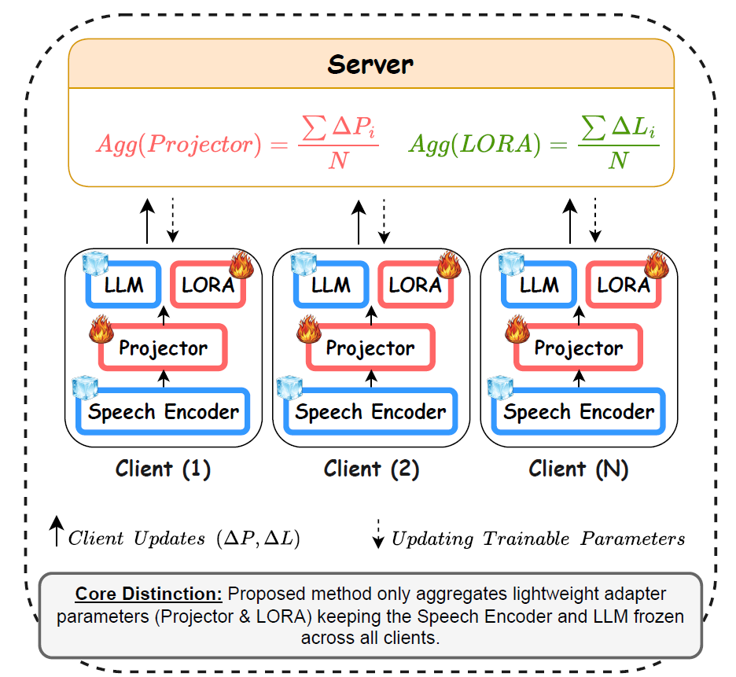

# SpeechLLM Meets Federated Learning for End-to-End ASR: English and Italian Case Studies

[](https://arxiv.org/abs/2607.25716)
[](#)
[](https://flower.ai/)
[](LICENSE)

Official implementation of **"SpeechLLM Meets Federated Learning for End-to-End ASR: English and Italian Case Studies"**, accepted at FLICS 2026.

**Authors:** Mohamed Nabih Ali, Daniele Falavigna, Alessio Brutti
**Affiliation:** Fondazione Bruno Kessler (FBK), Trento, Italy
**Contact:** mnabih@fbk.eu

---

## 📖 Overview

This repository contains the code for the first systematic study of **federated training for SpeechLLM-based end-to-end ASR**. We propose a communication-efficient federated optimization framework tailored to large speech-language architectures, evaluated on monolingual English and Italian ASR tasks.

**Key contributions:**
- First systematic study of federated learning applied to SpeechLLM-based ASR
- A communication-efficient FL strategy that aggregates only trainable (LoRA + projector) parameters
- A modified FedAvg with unified exponential learning rate decay (**Adaptive FedAvg**)
- Extensive evaluation across two speech encoders (WavLM-Large, Whisper-Medium) and two languages (English, Italian)
- Ablation study comparing full fine-tuning, adapter-based methods, and SpeechLLM/PEFT under FL

<p align="center">
  
</p>

---

## 🏗️ Architecture

The pipeline consists of:
1. **Speech Encoder** — WavLM-Large (317M params) or Whisper-Medium (769M params), frozen
2. **Projector** — two-stage linear adapter (projection + average pooling, k=2) mapping speech embeddings into the 2048-d TinyLlama input space
3. **LLM Backbone** — TinyLlama-1.1B-Chat-v1.0, frozen, adapted via **LoRA**
4. **Federated Training** — Flower-based FedAvg / Adaptive FedAvg, aggregating only LoRA + projector parameters across clients

---

## 📂 Repository Structure

\```
.
├── configs/                # YAML configs for FL rounds, clients, encoders, LR schedules
├── data/
│   ├── prepare_librispeech.py
│   └── prepare_mls_italian.py
├── models/
│   ├── speech_encoder.py   # WavLM / Whisper wrappers
│   ├── projector.py        # Linear adapter + average pooling
│   └── speechllm.py        # Full SpeechLLM (encoder + projector + LoRA-LLM)
├── federated/
│   ├── client.py           # Flower client (local training loop)
│   ├── server.py           # Flower server / strategy
│   └── strategies.py       # FedAvg, Adaptive FedAvg (exponential LR decay)
├── train_central.py        # Centralized training baseline
├── train_federated.py      # Federated training entry point
├── eval.py                 # WER evaluation
├── scripts/                # Shell scripts for reproducing experiments
├── requirements.txt
└── README.md
\```

---

## ⚙️ Installation

\```bash
git clone https://github.com/mnabihali/Fed-SpeechLLM.git
cd Fed-SpeechLLM
conda create -n fed-speechllm python=3.10
conda activate fed-speechllm
pip install -r requirements.txt
\```

**Core dependencies:** PyTorch, HuggingFace `transformers`, `peft` (LoRA), `flwr` (Flower), `torchaudio`.

---

## 📊 Datasets

| Dataset | Language | Train (hrs) | Train (spks) | Test (hrs) | Test (spks) |
|---|---|---|---|---|---|
| LibriSpeech-100 (train-clean-100 / test-clean) | English | 100 | 251 | 5.4 | 40 |
| MLS Italian | Italian | 247.38 | 65 | 5.27 | 10 |

\```bash
python data/prepare_librispeech.py --output_dir ./data/librispeech
python data/prepare_mls_italian.py --output_dir ./data/mls_it
\```

Each speaker is treated as one federated client (316 clients total in the multilingual setting).

---

## 🚀 Usage

### Centralized baseline
\```bash
python train_central.py --config configs/central_wavlm_ls.yaml
\```

### Federated training
\```bash
python train_federated.py \
  --config configs/federated_wavlm_ls.yaml \
  --strategy adaptive_fedavg \
  --num_rounds 100 \
  --clients_per_round 0.3
\```

### Evaluation
\```bash
python eval.py --checkpoint <path_to_checkpoint> --dataset test-clean
\```

Key hyperparameters (Adaptive FedAvg): `η0 = 0.001`, `γ = 0.9` (decay factor), `τ = 10` (decay period, rounds), `T = 100` (total rounds), 30% client participation per round, 10 local epochs.

---

## 📈 Results

### Adaptive FedAvg vs. vanilla FedAvg (WavLM, LibriSpeech)

| Round | FedAvg WER | Adaptive FedAvg WER |
|---|---|---|
| 20 | 19.7% | 9.7% |
| 100 | 7.9% | 6.4% |

Central training reference: **6.1%**

### Monolingual FL — WavLM vs. Whisper (WER % at round 100)

| Encoder | LibriSpeech (FL) | LibriSpeech (Central) | MLS Italian (FL) | MLS Italian (Central) |
|---|---|---|---|---|
| WavLM-Large | 6.4 | 6.1 | 22.6 | 20.1 |
| Whisper-Medium | 6.6 | 6.0 | 18.7 | 17.5 |

### SpeechLLM vs. full fine-tuning vs. adapters (LibriSpeech)

| Training | Model | # Params | WER (%) |
|---|---|---|---|
| Centralized | WavLM-FT | 85.1M | 4.4 |
| Centralized | WavLM EL-adapters | 9.1M | 4.6 |
| Centralized | Speech-LLM | 8.4M | 6.1 |
| Federated | WavLM-FT | 85.1M | ✗ (fails to converge) |
| Federated | WavLM EL-adapters | 9.1M | 6.1 |
| Federated | Speech-LLM | 8.4M | 6.4 |

### Monolingual → Multilingual (all 316 clients, WavLM, round 100)

| Dataset | Federated WER | Central WER | Gap |
|---|---|---|---|
| LibriSpeech (EN) | 16.8% | 6.1% | +10.7 pp |
| MLS Italian | 19.7% | 18.4% | +1.3 pp |

---

## 📄 Citation

If you use this code or find our work helpful, please cite:

\```bibtex
@inproceedings{ali2026speechllm,
  title     = {SpeechLLM Meets Federated Learning for End-to-End ASR: English and Italian Case Studies},
  author    = {Ali, Mohamed Nabih and Falavigna, Daniele and Brutti, Alessio},
  booktitle = {Proceedings of FLICS 2026},
  year      = {2026},
  eprint    = {2607.25716},
  archivePrefix = {arXiv}
}
\```

---

## 🙏 Acknowledgements

This work was carried out at the SpeechTek unit, Fondazione Bruno Kessler (FBK), Trento, Italy.

---

## 📬 Contact

For questions or issues, please open a GitHub issue or contact:
- Mohamed Nabih Ali — mnabih@fbk.eu

---

## 📜 License

This project is released under the [MIT License](LICENSE).
